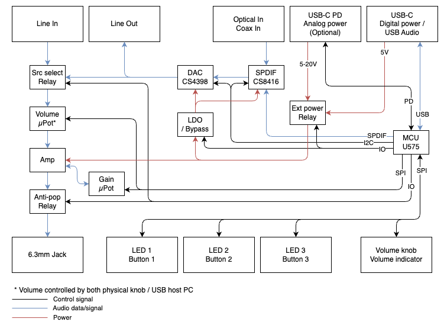

## Project-H10

DAC / Headphone Amp

Features:
- Audio input: USB(C), SPDIF(Coax/TOSLINK), Line(RCA)
- Audio output: Line(RCA), Headphone(6.3mm)
- PCM support: 16, 24, 32bit / 48, 96, 192kHz
- Volume control (Mute, -78 -> 0 dB)
- Adjustable gain (0 -> 18 dB)
- Swapable DAC / OpAmps
- Seperate analog power supply (Optional USB-C 5V / PD 9V, 15V, 20V)



### Electronics

```
Jack
BoardConn 03JQ-ST (C378905)
6.3mm PJ-609BA (C309277)

Panel
BoardConn 08JQ-ST (C593685)
Encoder EC12E2430803 (C470684)
RGB LTST-S310F3WT (C284951)
Driver: STP16CPC26XTR (C411391)
Input: 74HCT165D (C456131)
Pushbutton https://www.aliexpress.com/item/1005002530474849.html

Platform
OpAmpSocket Z-100083200100100 (C115171)
USB-C GT-USB-7010C (C2843967)
Toslink ZGY133/T8(PLT) (C277780)
SPDIF CS8416 (C11163)
LDO BA78M05FP-E2 (C79645)
VGnd BUF634A (C2058426)
Relay HFD3/5 (C36460)
MCU STM32U575VGT6 (C5270988)
DigiPot LM1972 (Mouser 926-LM1972MX/NOPB)
RCA https://www.aliexpress.com/item/32815383067.html

DAC
BoardConn 08JQ-BT (C163025)
DAC CS4398-CZZR (C9931)
```

### Firmware

Environment Setup
```
$ brew install python cmake ninja armmbed/formulae/arm-none-eabi-gcc
$ pip3 install poetry
$ poetry install
$ poetry run mbed-tools deploy
$ poetry run mbed-tools compile -t GCC_ARM -m NUCLEO_U575ZI_Q -b release
```

VSCode Extensions: `C/C++`, `CMake`